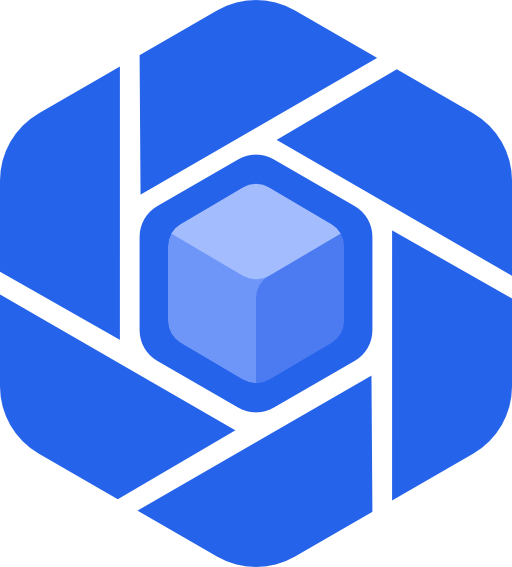

<!--
  SPDX-FileCopyrightText: 2026 Kubuno contributors
  SPDX-License-Identifier: AGPL-3.0-or-later
-->

<div align="center">



# Kubuno — API spec

[](LICENSE)


**The OpenAPI description and generated clients for the native apps of [Kubuno](https://github.com/kubuno/core) — the self-hosted, libre (AGPLv3) cloud platform, a sovereign alternative to Google Workspace and Microsoft 365.**

</div>

---

The OpenAPI 3.1 description of the Kubuno API surface used by the **native
mobile apps** (iOS / Android), plus the generated typed clients.

## Contents

| Path | What |
|------|------|
| `openapi.json` | The mobile API spec (auth, me/sessions, push, drive sync, files/folders). |
| `build_spec.py` | Builds `openapi.json` from the live core spec + the drive/push surface. |
| `generate.sh` | Fetch spec → build → generate the Swift & Kotlin clients. |
| `clients/swift` | Generated Swift client (SwiftPM, async/await). Package `KubunoAPI`. |
| `clients/kotlin` | Generated Kotlin client (OkHttp4 + kotlinx.serialization). Package `com.kubuno.api`. |

The spec's core paths (`/auth/*`, `/me`, `/modules`) come **from the server**
(generated by utoipa, fetched from `/api/v1/openapi.json`). The drive and push
paths are documented in `build_spec.py` from their handlers — they will move to
server-generated specs once those modules expose their own OpenAPI.

## Regenerate

Requires Java (for openapi-generator) and a running core (default
`http://localhost:8080`):

```bash
bash generate.sh                       # uses http://localhost:8080
bash generate.sh https://cloud.example # against another instance
```

## Using the clients

**iOS (Swift Package Manager)** — add `clients/swift` as a local package, then:

```swift
import KubunoAPI

KubunoAPIAPI.basePath = "https://cloud.example"
let tokens = try await AuthAPI.apiV1AuthLoginPost(loginDto:
    LoginDto(login: "me@example.com", password: "…", clientType: "native"))
// tokens.refreshToken → store in the Keychain; tokens.accessToken → bearer
let delta = try await DriveSyncAPI.apiV1DriveSyncDeltaGet(cursor: 0)
```

**Android (Gradle)** — include `clients/kotlin` (OkHttp4 + kotlinx.serialization).
`AuthApi`, `DriveSyncApi`, `PushApi`, … mirror the Swift surface.

> The `If-Match` and `Idempotency-Key` headers are exposed as typed parameters
> (e.g. `apiV1DriveSyncFileIdContentPut(id:body:ifMatch:idempotencyKey:)`), so
> the offline-first sync logic (conflict detection, safe replay) is first-class
> in the clients.

## Continuous integration

`.github/workflows/validate.yml` lints the spec (Redocly) on every push and pull request.

## Note

`clients/` is generated code — regenerate it with `generate.sh` rather than
editing by hand.

## Security

Please report vulnerabilities privately — see [`SECURITY.md`](SECURITY.md).

## License

[AGPL-3.0-or-later](LICENSE) © Kubuno contributors.
